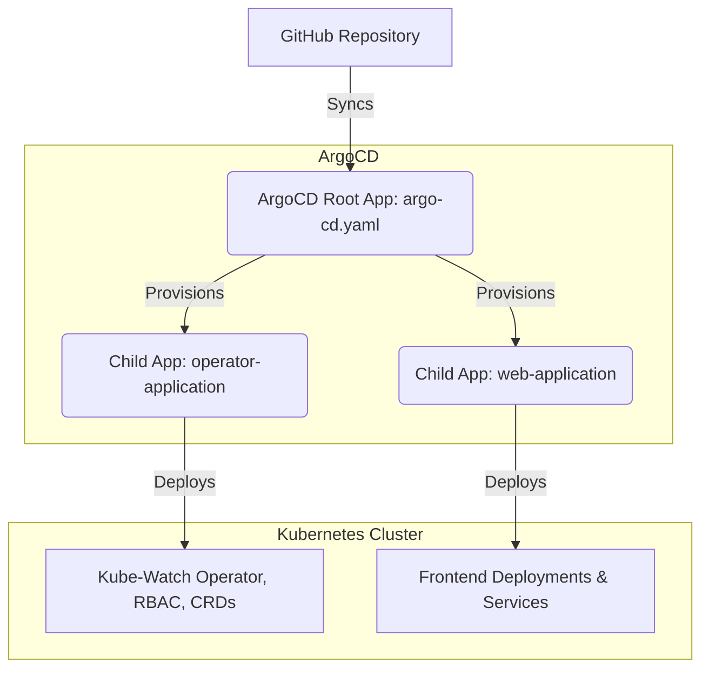
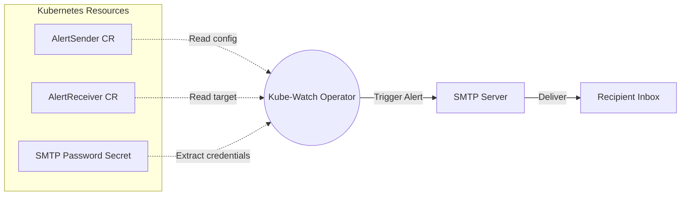

# GitOps Kubernetes Deployment with ArgoCD and Custom Operator

This repository contains a complete GitOps workflow managed by ArgoCD. It utilizes the "App of Apps" pattern to deploy and manage a highly available Web Server and a custom Kubernetes Operator (kube-watch) that monitors the cluster and sends email alerts.

## Architecture and Pattern

This project follows the **App of Apps** pattern. Instead of deploying resources manually, a single root ArgoCD application monitors the Git repository and automatically provisions child applications, which in turn manage the actual Kubernetes resources.



## Repository Structure
```text
├── argo-cd.yaml                # The Root ArgoCD Application (App of Apps)
├── argo-cd/                    # Contains child ArgoCD Application manifests
│   ├── operator-application.yaml # Manages the kube-watch operator deployment
│   └── web-application.yaml      # Manages the web server deployment
├── kube-watch/                 # Custom Operator Manifests
│   ├── sender-crd.yaml         # AlertSender Custom Resource Definition
│   ├── receiver-crd.yaml       # AlertReceiver Custom Resource Definition
│   ├── clusterRole.yaml        # RBAC Permissions for the operator
│   ├── clusterRoleBinding.yaml # RBAC Binding
│   ├── serviceaccount.yaml     # Operator Service Account
│   ├── namespace.yaml          # creative-operator namespace
│   └── operator-deployment.yaml# The Java-based Operator Deployment
└── webserver/                  # Web Application Manifests
    ├── frontend-deploy.yaml    # Apache HTTPD Deployment (3 Replicas)
    └── frontend-svc.yaml       # LoadBalancer Service
```

## Components Overview

### 1. Web Server 
A highly available frontend application running Apache HTTPD.
- **Replicas:** 3
- **Exposure:** Exposed externally via a `LoadBalancer` service on port 80.

### 2. Kube-Watch Operator
A custom Kubernetes Operator built to watch cluster events and trigger email notifications. It operates using the custom API group `j-kube-watch.app/v1` and introduces two Custom Resources:
- **AlertSender**: Configures the SMTP server details and references a Kubernetes Secret for credentials.
- **AlertReceiver**: Configures the target email address and links to an existing AlertSender.

### Operator Workflow



## Prerequisites

Before applying this repository, ensure you have the following in your environment:
1. A running Kubernetes Cluster.
2. ArgoCD installed in the `argocd` namespace.
3. A LoadBalancer provisioner (e.g., MetalLB) if running on bare-metal clusters.

## How to Deploy

Because this repository uses the App of Apps pattern, you only need to apply the root application. ArgoCD will handle the rest automatically.

1. Apply the root application:
   ```bash
   kubectl apply -f argo-cd.yaml
   ```

2. Open your ArgoCD UI. You will observe the root application syncing and automatically generating the `web-server` and `kube-watch-operator` child applications.

## Configuring the Alert Operator

Once the operator is running successfully, you can configure your email alerts by creating a Secret for your SMTP password, followed by an `AlertSender`, and an `AlertReceiver`.

**Example Configuration:**
```yaml
# 1. Create a Secret for SMTP Password
apiVersion: v1
kind: Secret
metadata:
  name: my-smtp-secret
type: Opaque
stringData:
  password: "your-app-password"

---
# 2. Configure the Sender
apiVersion: j-kube-watch.app/v1
kind: AlertSender
metadata:
  name: main-sender
spec:
  email: "your-email@gmail.com"
  host: "smtp.gmail.com"
  port: "587"
  secretName: "my-smtp-secret"

---
# 3. Configure the Receiver
apiVersion: j-kube-watch.app/v1
kind: AlertReceiver
metadata:
  name: manager-receiver
spec:
  email: "manager-email@gmail.com"
  senderRef: "main-sender"
```

## Automated Sync and Self-Healing

Both child applications are configured with ArgoCD's strict sync policies:
- **Automated Pruning:** Any resource deleted from the Git repository will be automatically removed from the Kubernetes cluster.
- **Self-Heal:** Any manual modifications made directly to the cluster resources will be automatically overwritten and reverted to the state defined in this Git repository.
